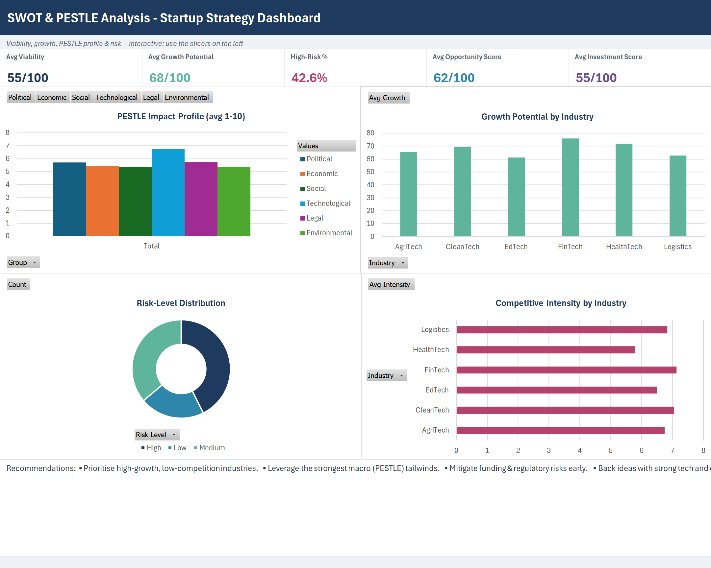

# 🧭 SWOT & PESTLE Analysis for a Startup Idea

A consulting-style **strategic analysis** project that evaluates startup ideas on internal
**SWOT** (Strengths, Weaknesses, Opportunities, Threats) and external **PESTLE** (Political,
Economic, Social, Technological, Legal, Environmental) factors — delivered as a single,
executive-ready **Excel dashboard** plus strategy reports.

---

## 🎯 Objective
Assess the feasibility, risks, opportunities, and long-term growth potential of startup ideas
using SWOT and PESTLE frameworks, and rank their investment attractiveness.

## 💡 Startup Idea Description
A portfolio of **108 startup ideas** across AgriTech, FinTech, HealthTech, EdTech,
CleanTech, and Logistics — each scored on strengths/weaknesses, market opportunity/threat, six
PESTLE impact factors, competitive intensity, risk level, and growth potential.

## 🧩 SWOT Framework
Internal **Strengths** & **Weaknesses** vs external **Opportunities** & **Threats**, captured
per idea and aggregated to reveal the dominant patterns across the portfolio.

## 🌐 PESTLE Framework
Macro-environmental scoring (1–10) on Political, Economic, Social, Technological, Legal, and
Environmental factors, visualised as an impact profile.

## 🏭 Industry Analysis
Growth potential and competitive intensity benchmarked by industry to find attractive,
low-rivalry spaces.

## ⚠️ Risk Assessment
A composite risk level (Low/Medium/High) derived from competitive intensity and macro
favourability flags the ideas needing the most mitigation.

## 📦 Dataset
[`data/startup_swot_pestle_data.csv`](data/startup_swot_pestle_data.csv) — **20 fields, 108 records**.

## 📊 Dashboard



An **interactive Excel dashboard** built on native **PivotTables, PivotCharts, and Slicers**, laid out on one landscape page:
- **Slicers (left rail):** **Industry, Risk Level, Region** — click any value and **every chart and KPI re-filters instantly** (all four PivotCharts and the KPI cards share one PivotCache).
- **KPI band (top):** Avg Viability, Avg Growth Potential, High-Risk %, Avg Opportunity Score, Avg Investment Score — live `GETPIVOTDATA` cards that update with the slicers.
- **PivotCharts (2×2):** PESTLE Impact Profile (6-factor), Growth Potential by Industry, Risk-Level Distribution, Competitive Intensity by Industry.
- **Recommendations panel** at the bottom; the raw data is a filterable Excel **Table** (`tblStartup`) on the `Data` sheet.

> Built natively in Excel (PivotTables sourced from the named Table), following the method in `Pivot Tables in Excel using claude.docx`.

## 💡 Key Insights
- Most attractive industry: **FinTech** (76/100 growth potential).
- Strongest macro factor: **Technological** (6.8/10).
- **42.6%** of ideas are High-risk; avg viability **55/100**.
- Top investment candidate: a **HealthTech** idea (79/100).

## 🧭 Strategic Recommendations
- Prioritise high-growth, low-competition industries (e.g. **FinTech**).
- Leverage the **Technological** tailwind; mitigate funding/regulatory risks early.
- Back ideas with strong technology and clear differentiation; stage capital to risk.

## 🗂️ Repository Structure
```
SWOT & PESTLE Analysis for a Startup Idea/
├─ README.md
├─ SWOT & PESTLE Analysis for a Startup Idea.docx              # brief
├─ Project Descriptions (Resume + ATS).docx
├─ data/startup_swot_pestle_data.csv
├─ dashboard/SWOT_PESTLE_Startup_Dashboard.xlsx
├─ reports/SWOT & PESTLE Strategic Analysis Report.docx
├─ docs/ (dashboard_image_prompt.md, screenshots/)
└─ Linkedin Post/linkedin_post.docx
```

## 🧾 Conclusion
The project demonstrates structured strategic analysis — SWOT, PESTLE, risk, and feasibility
scoring — packaged as a recruiter-ready Excel dashboard and report that help founders,
consultants, and investors judge a startup idea with evidence.
